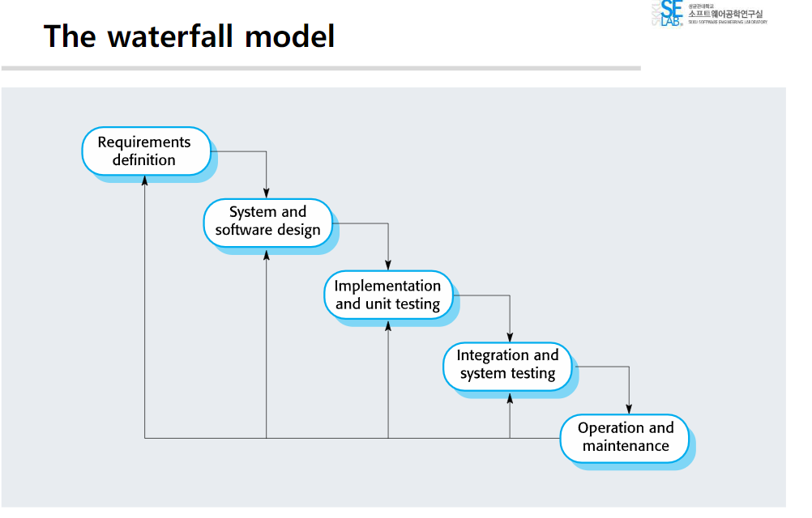
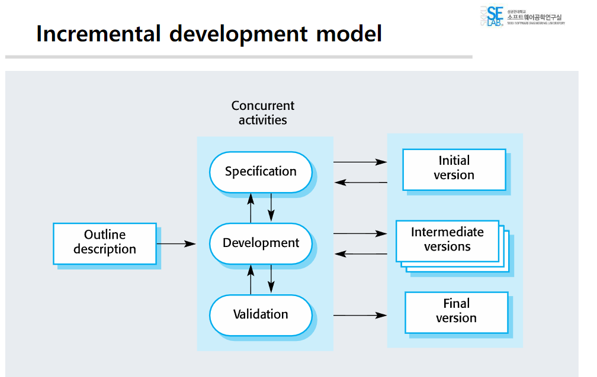
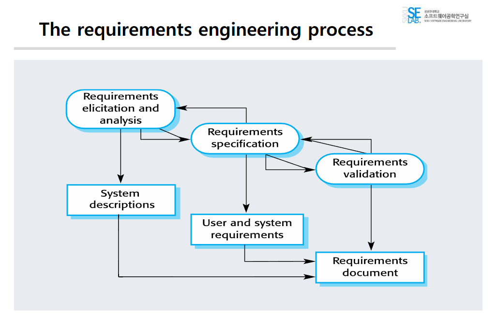
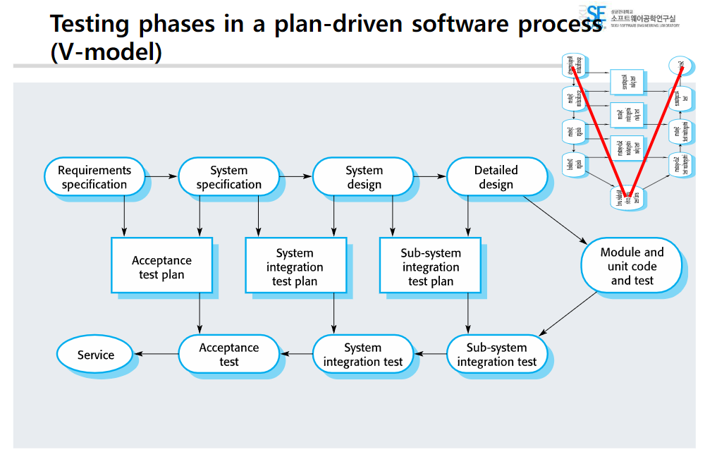

## 2019311801 이균서

## A1

강점: requirement가 굉장히 명확한 경우에, 혹은 대규모 시스템을 개발하는 경우에 강점을 보인다. 서브 시스템을 병렬적 개발할 때 좋다. 대형 프로젝트에 적합하다. 개발 초기에 아키텍처 디자인이 된다.

약점: 어떤 프로세스가 진행되고 나서의 변경은 굉장히 어렵다. requirement가 처음부터 명확하게 정의되기 어렵다. rework cost가 많이 발생한다. 프로젝트 가시성(문서화)이 좋다. 흐름을 파악하기가 좋다.

## A2

강점: 변화하는 고객 요구사항을 수용하는 비용이 줄어든다, 개발 작업에 대한 고객의 의견을 보다 쉽게 얻을 수 있다, 고객에게 유용한 소프트웨어를 보다 신속하게 제공하고 배포할 수 있다. rework이 줄어든다.

약점: iteration이 많이 일어나서, document 생성하기가 너무 어렵고 그래서 visibility가 매우 낮고, 프로세스 과정이 잘 보이지 않는다, 시스템 구조가 새로운 increment(증분)가 추가됨에 따라 저하되는 경향이 있다.

## A3

개념: 기존 코드의 외부 동작을 변경하지 않으면서 내부 구조를 개선하는 과정. 코드 확장성 개선 등. 가독성을 높이는 것.

예시: 클래스 통합, 함수 분할, 변수 이름 변경, 중복 코드 제거, 데이터 베이스 구조 변경 등.

## A4

Waterfall 모델은 폭포처럼 top-down 방식으로 진행. 선형적이며 각 단계가 순차적으로 진행됨. reverse flow나 피드백이 불가능한 게 아님.

반면, Incremental 모델은 여러 단계로 나누어진 기능을 점진적으로 개발하며 각 단계마다 피드백을 받음. (process activities가 inter-leaved돼 있다.) concurrent activities를 반복한다는 것이다.

## A5

1. 요구 사항 명세: 어떤 서비스가 요구되는지, 그리고 시스템의 작동과 개발에 있어 제한사항을 설립하는 과정

2. 설계 및 구현 : system specification을 executable 프로그램으로 변환하는 과정

3. 검증: Verification(specificatio에 conform하는지)과 Validation(system customer의 requirements를 만족하는지)을 체크하는 과정.

4. 진화: software가 사용됨에 따라 발생하는 변경을 수용하는 과정

## A6

- feasibility study: 시스템을 구성하는 것이 실현 가능한지

- requirements elicitation and analysis: system의 stakeholders가 요구하고 기대하는 것이 무엇인지

- requirements specification: 요구 사항의 세부사항을 정의

- requirements validation: 요구 사항의 validity(유효성)을 확인

최종적인 요구사항 문서를 작성한다.

요구사항 문서를 작성하는 것이 requirements engineering이다.

## A7

컴포넌트 테스트: 개별 컴포넌트가 제대로 동작하는지 확인하기 위해, 독립적으로 테스트.

시스템 테스트: 전체 시스템을 테스트. emergent properites(세으피티 시큐리티 릴라이벌리티) non-functionality 가 중요함.

수용 테스트: 실제 고객의 데이터로 시스템을 테스트하여 고객의 요구 사항을 충족하는지 확인.

release, delivery: 고객에게 단순히 던져 주는 것
deployment: 고객의 환경에 맞게 배치 해주는 것

## A8

V-model을 기준으로,

- acceptance test는 requirements sepcication과 system specification에서 plan
- system integration test는 system specification과 system design에서 plan
- sub-system integration test는 system design과 detailed design에서 plan

why? test를 미리 염두에 두고, 개발을 진행하면 보다 더 구체적이고 명확한 요구사항을 도출할 수 있기 때문이다.

## A9

재작업이란 요구 사항이 변경되어 기존의 시스템을 수정해야 하는 경우를 말한다. 재작업 비용은 시스템이 완성된 후에 발생하는 비용이다.

재작업 비용 감소 방법:

- change avoidance: 변화가 필요없도록 처음부터 잘 설계. prototype을 사용하여 고객의 요구 사항을 명확히 하고, 이를 기반으로 시스템을 개발.

- change tolerance: incremental development처럼 변화에 적응. 빠른 개발방법을 사용한다.

## A10

프로토 타입: 최소한의 기능과 interface만 있고 안에는 더미 모듈만 있는 것.

이점:

- 시스템 사용성 향상
- 사용자의 실제 필요에 더 근접
  프로토 타입으로 사용자입장에서 느낄 불편함 등을 미리 느껴 볼 수 있기 때문에, 품질이 향상될 수 있다.
- 설계 품질 향상
- 유지 보수성 향상
- 개발 노력 감소

이런 benefits이 존재하는 이유: 프로토 타입은 결국 명확하지 않은 것들을 명확하게 하기 위해 만드는 것이기 때문에, 프로토타입을 만듦으로써 보다 애매모호한 것들을 명확하게 할 수 있다.

## A11

throw-away 프로토타이핑: 프로토타입이 개발된 후 폐기되어야 하는 프로토타이핑 방식. 명확하지 않은 기능을 명확하게 하기 위해 사용되는 방식.

exploratory 프로토타이핑: 프로토타이핑이 완성되고 나서, 이를 확장해 나가면서 시스템을 개발하는 방식. 바람직 하지 않다.

## A12

incremental development는 system을 increment 단위로 개발하는 것이다. increment라는 것은 2~4주 정도에서 개발할 만한 기능을 의미한다. 또 이를 반복적으로 개발하는 것이다. 그리고 각 increment에 대해 evaluation을 진행한다. 또 이를 바탕으로 integrationg을 한다. agile method가 유명한 예시이다.
evalution은 user/customer가 진행한다.
incremental delivery는 end-users의 use를 위해 increment를 deploy를 하는 것이다. 계속 반복적으로 진행한다. single delivery는 한 번에 모든 것을 deploy하는 것이다. 반면에 incremental delivery에서는 user requirement가 prioritized되고, 가장 높은 우선 순위를 갖는 requirement가 가장 이른 increment에 포함된다. 그래서 중요하게 생각되는 increment가 가장 먼저 deploy되기 때문에, 고객 입장에서 시스템에 대해 confident을 더욱 갖게된다.

## A13

어떤 데이터를 사람들이 많이 쓰더라, 어떤 기능을 사람들이 많이 쓰더라 이걸 묻는 질문.

사람들이 많이 안 쓰는 쪽의 기능을 개선 시키는 것보다, 어떤 쪽의 데이터를 사람들이 많이 쓰느냐. 그런 쪽의 기능을 개선 시키는 것이 더 좋다. defect는 숨어 있다. 예를 들어, 프로덕트 분석 솔루션인 amplitude를 사용하여, 그런 쪽의 기능을 빨리 파악해서 개선할 수 있다.

## Questions from your ownself

- 팀에서 선택된 Q: 프로토타입이 표현할수 있는 가시성과 정보에는 한계가 있다. 예를 들어 대규모의 프로젝트는 프로토타입과 최종결과물은 많이 다를 수 밖에 없는데, 그 간극 을 어떻게 채우고 고객한테 설명할 것인가.

A: UI를 보여주려고 하는 것이 프로토타입이다. 문서로만 보여주면 설득력이 없어서 만드는 것일 뿐이다. 그래서 working system으로 간단히 데모만 보여주면 된다. 간극이 있을 수밖에 없음을 설득하면 될 것이다.
